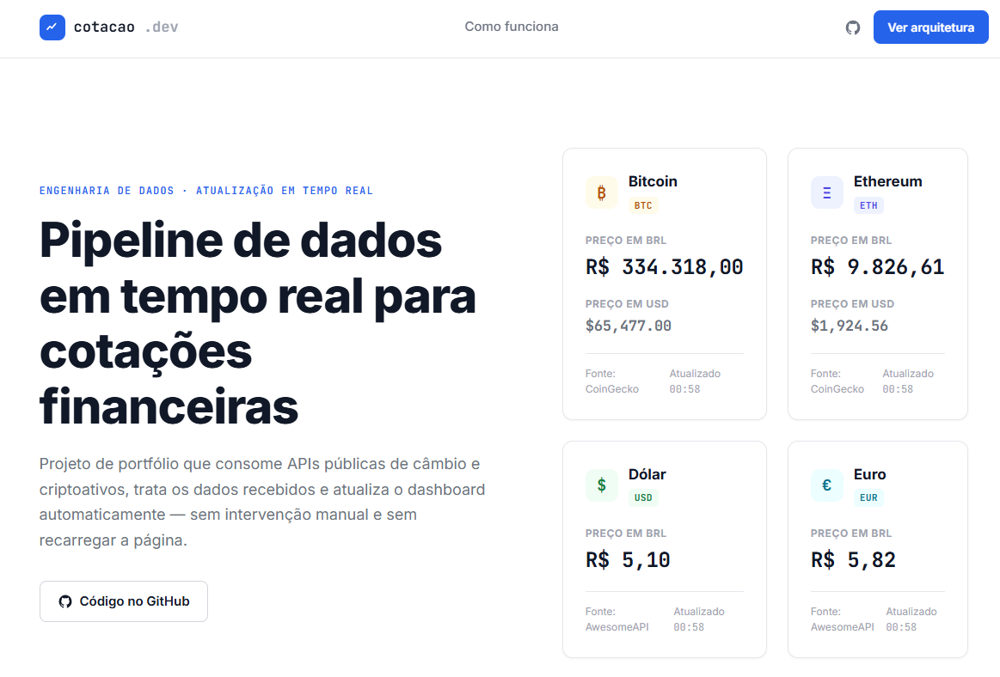
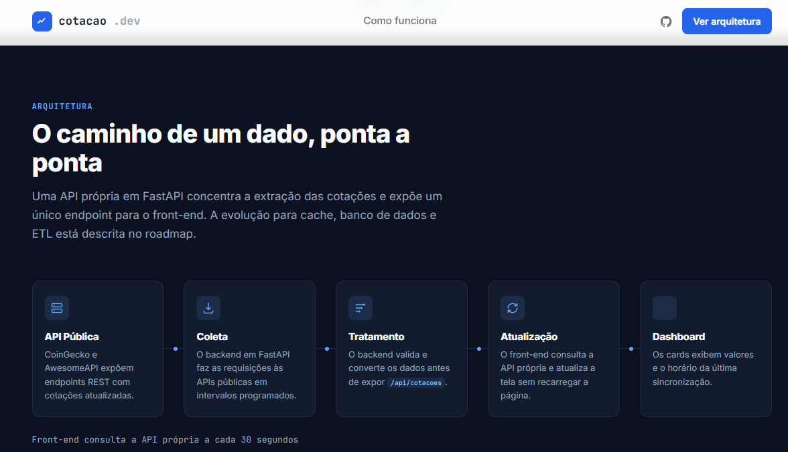

# 📊 Real-Time Crypto & Exchange Rate Dashboard

> Um sistema full-stack leve de engenharia de dados para coleta automatizada (ETL), armazenamento local e exibição em tempo real de cotações de criptomoedas e taxas de câmbio.

---
| | |
|:---:|:---:|
|  |  |

## 🛠️ Tecnologias Utilizadas

* **Python 3.10+** (Pipeline ETL e Back-end)
* **FastAPI** (API REST de alta performance)
* **SQLite** (Armazenamento e persistência de dados)
* **HTML5, CSS3 & JavaScript (ES6+)** (Front-end e atualização assíncrona via `fetch`)
* **Uvicorn** (Servidor ASGI)

---

## 🏗️ Arquitetura do Projeto

O projeto é dividido em três camadas principais para garantir desacoplamento e escalabilidade:
1. **Pipeline de Ingestão (ETL):** Um script em Python (`app.py`) que consome dados de APIs de mercado em intervalos regulares e os persiste de forma estruturada.
2. **Data Delivery Service (API REST):** Uma aplicação FastAPI (`api.py`) que expõe endpoints otimizados para consultar os registros mais recentes por meio de subqueries SQL eficientes.
3. **Dashboard (Front-end):** Uma interface web responsiva que consome a API de forma assíncrona (`setInterval` a cada 30 segundos) sem a necessidade de recarregar a página.

---

## 🚀 Como Executar o Projeto Localmente

Siga os passos abaixo para configurar e rodar a aplicação em sua máquina.

### Pré-requisitos
Certifique-se de ter o **Python** instalado em seu sistema.

### 1. Clonar o repositório
```bash
git clone [https://github.com/SEU-USUARIO/SEU-REPOSITORIO.git](https://github.com/SEU-USUARIO/SEU-REPOSITORIO.git)
cd SEU-REPOSITORIO
